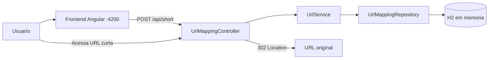

# URL Shortener Full Stack

Aplicacao full stack para criacao de URLs curtas temporarias. O frontend Angular recebe uma URL, solicita o encurtamento ao backend Spring Boot e apresenta o link gerado. O backend persiste o mapeamento em um banco H2 em memoria e redireciona o codigo curto para a URL original enquanto o registro estiver valido.

> O projeto esta configurado para desenvolvimento local. URLs publicas, banco de dados e parte das configuracoes ainda nao estao preparados para producao.

## Funcionalidades

- Criacao de URL curta com codigo aleatorio alfanumerico de 6 caracteres.
- Reutilizacao do mapeamento quando a mesma URL original ja esta cadastrada.
- Redirecionamento HTTP `302 Found` para a URL original.
- Expiracao do mapeamento apos 7 dias.
- Rate limit de 3 chamadas a cada 30 segundos.
- Interface responsiva com temas claro e escuro.
- Persistencia da preferencia de tema no `localStorage`.
- Feedback visual de sucesso, erro generico e limite de requisicoes.
- Console H2 disponivel durante o desenvolvimento.
- CORS configuravel para a criacao de URLs curtas.

## Stack

### Frontend

| Tecnologia           | Uso                                            |
| -------------------- | ---------------------------------------------- |
| Angular 22           | Aplicacao web standalone e componentes         |
| TypeScript 6         | Linguagem                                      |
| Angular Signals      | Estado local da interface                      |
| Angular HttpClient   | Integracao com a API                           |
| RxJS 7               | Fluxo da requisicao HTTP                       |
| Tailwind CSS 4       | Utilitarios de layout e estilos globais        |
| CSS com tokens OKLCH | Temas claro e escuro e estilos dos componentes |
| Vitest + jsdom       | Testes unitarios                               |
| Prettier             | Formatacao                                     |

### Backend

| Tecnologia                  | Uso                                   |
| --------------------------- | ------------------------------------- |
| Java 21                     | Linguagem e runtime                   |
| Spring Boot 4.1.1           | Aplicacao backend                     |
| Spring Web MVC              | API REST e redirecionamento HTTP      |
| Spring Data JPA / Hibernate | Persistencia e acesso a dados         |
| H2                          | Banco relacional em memoria           |
| Resilience4j 2.4.0          | Rate limiting                         |
| Lombok                      | Geracao de boilerplate Java           |
| Maven                       | Build e gerenciamento de dependencias |
| JUnit 5 / Spring Test       | Testes do backend                     |

## Arquitetura



O repositorio possui dois projetos independentes:

```text
.
├── backend/
│   ├── http/                       # Requisicoes manuais
│   ├── src/main/java/com/desafio/url_shortener/
│   │   ├── controller/             # Contrato HTTP
│   │   ├── domain/entity/          # Entidades JPA
│   │   ├── dto/                    # Objetos de resposta
│   │   ├── exception/              # Respostas globais de erro
│   │   ├── repository/             # Repositorios Spring Data
│   │   ├── service/                # Regras de encurtamento e resolucao
│   │   └── UrlShortenerApplication.java
│   ├── src/main/resources/
│   │   └── application.properties
│   ├── src/test/                   # Testes Spring
│   └── pom.xml
└── frontend/
    ├── public/                     # Assets estaticos
    ├── src/app/
    │   ├── components/             # Formulario e componentes de UI
    │   ├── services/               # Integracao HTTP
    │   ├── app.config.ts           # Providers globais
    │   ├── app.routes.ts           # Rotas, atualmente vazias
    │   └── app.*                   # Componente raiz e tema
    ├── src/styles.css              # Tailwind e tokens globais
    ├── angular.json
    └── package.json
```

### Fluxo de encurtamento

1. O usuario informa uma URL no frontend.
2. O componente remove espacos no inicio e no fim e utiliza a validacao nativa de um campo HTML `type="url"` obrigatorio.
3. O servico Angular envia `POST /api/short`, com a URL no query parameter `url` e sem corpo.
4. O backend procura um registro com a URL original exatamente igual.
5. Se encontrar, devolve o mapeamento existente. Caso contrario, gera um codigo com `SecureRandom`, verifica sua disponibilidade e salva o registro com validade de 7 dias.
6. A API responde com a URL curta em texto puro e status `201 Created`.

### Fluxo de redirecionamento

1. O navegador acessa `GET /api/{shortCode}`.
2. O backend procura o codigo no H2 e verifica a expiracao.
3. Para um registro valido, responde `302 Found` com a URL original no header `Location`.
4. Codigos inexistentes ou expirados sao processados pelo handler global e atualmente retornam `400 Bad Request`.

## Como executar

### Pre-requisitos

- JDK 21.
- Maven instalado no sistema.
- Node.js `^22.22.3`, `^24.15.0` ou `>=26.0.0`.
- npm 11; o projeto declara `npm@11.19.0`.

> Os arquivos `mvnw` e `mvnw.cmd` existem, mas o diretorio `.mvn/wrapper` nao esta versionado. Em um clone limpo, use o Maven instalado no sistema ate que o wrapper seja restaurado.

### 1. Iniciar o backend

Em um terminal:

```bash
cd backend
mvn spring-boot:run
```

A API inicia em `http://localhost:8080`.

### 2. Iniciar o frontend

Em outro terminal:

```bash
cd frontend
npm ci
npm start
```

A interface fica disponivel em `http://localhost:4200`.

O backend permite essa origem por padrao. Para usar outra origem no frontend:

```bash
cd backend
FRONTEND_ORIGIN=http://localhost:4300 mvn spring-boot:run
```

## API REST

Base URL local: `http://localhost:8080/api`

### Criar ou recuperar uma URL curta

```http
POST /api/short?url=https%3A%2F%2Fexample.com
Content-Length: 0
```

Exemplo com cURL:

```bash
curl -i -X POST 'http://localhost:8080/api/short?url=https%3A%2F%2Fexample.com'
```

Resposta de sucesso:

```http
HTTP/1.1 201 Created
Content-Type: text/plain

http://localhost:8080/api/aB3xZ9
```

Detalhes do contrato:

| Item                   | Valor                                                |
| ---------------------- | ---------------------------------------------------- |
| Parametro              | `url`, query parameter obrigatorio                   |
| Corpo                  | Vazio                                                |
| Sucesso                | `201 Created`                                        |
| Resposta               | URL curta como `text/plain`                          |
| Idempotencia funcional | A mesma string de URL reutiliza o registro existente |

O backend nao normaliza nem valida a URL antes de persisti-la. A igualdade utilizada para reaproveitar um mapeamento e textual e exata.

### Redirecionar pelo codigo curto

```http
GET /api/{shortCode}
```

Exemplo:

```bash
curl -i 'http://localhost:8080/api/aB3xZ9'
```

Resposta de sucesso:

```http
HTTP/1.1 302 Found
Location: https://example.com
```

### Erros

O handler global atual converte excecoes em `400 Bad Request` no seguinte formato:

```json
{
  "timestamp": "2026-09-16T12:00:00",
  "status": 400,
  "error": "Erro de regra de negocio",
  "mensagens": ["URL nao encontrada"]
}
```

Isso inclui atualmente URL inexistente, URL expirada e erros de rate limit. O frontend tambem reconhece `429 Too Many Requests`, caso esse status venha a ser retornado pela API.

## Backend

### Camadas

- `UrlMappingController`: declara os endpoints, status HTTP, CORS e redirecionamento.
- `UrlService`: implementa reutilizacao, geracao de codigo, expiracao e resolucao.
- `UrlMappingRepository`: consulta por URL original e codigo curto e verifica a existencia de codigos.
- `UrlMapping`: representa a tabela `url_mapping`.
- `UrlMappingResponse`: DTO interno com URL original, URL curta, expiracao e codigo. O endpoint de criacao expoe somente o campo da URL curta.
- `globalHandlerException`: centraliza respostas de erro.

### Regras de dominio implementadas

- O codigo curto possui 6 caracteres.
- O alfabeto permitido e `A-Z`, `a-z` e `0-9`.
- A geracao usa `SecureRandom`.
- O servico consulta a existencia do codigo e repete a geracao em caso de colisao.
- A coluna `short_code` tambem possui constraint `unique`.
- Um novo registro recebe `createdAt` com o horario local atual.
- A expiracao e calculada como o horario local atual mais 7 dias.
- Uma URL original ja cadastrada e retornada sem criar um novo registro.

### Persistencia

O banco configurado e o H2 em memoria:

| Propriedade     | Valor                              |
| --------------- | ---------------------------------- |
| JDBC URL        | `jdbc:h2:mem:testdb`               |
| Usuario         | `sa`                               |
| Senha           | vazia                              |
| DDL             | `update`                           |
| Exibicao de SQL | habilitada                         |
| Console         | `http://localhost:8080/h2-console` |

Modelo da tabela:

| Coluna         | Tipo logico     | Restricao                |
| -------------- | --------------- | ------------------------ |
| `id`           | `Long`          | Chave primaria, identity |
| `short_code`   | `String`        | Unico                    |
| `original_url` | `TEXT`          | URL de destino           |
| `created_at`   | `LocalDateTime` | Data de criacao          |
| `expires_at`   | `LocalDateTime` | Data de expiracao        |

Os dados sao descartados sempre que o processo backend e encerrado.

### Rate limit

O `@RateLimiter(name = "url")` esta aplicado no controller inteiro, portanto afeta tanto a criacao quanto o redirecionamento:

| Configuracao         | Valor                                     |
| -------------------- | ----------------------------------------- |
| Limite               | 3 permissoes                              |
| Periodo de renovacao | 30 segundos                               |
| Espera por permissao | 0 segundos                                |
| Escopo atual         | Compartilhado pela instancia da aplicacao |

Nao ha identificacao por IP, usuario ou token.

### CORS e seguranca

- `POST /api/short` aceita por padrao a origem `http://localhost:4200`.
- A origem pode ser substituida pela variavel `FRONTEND_ORIGIN`.
- O endpoint de redirecionamento nao possui configuracao CORS explicita.
- Nao ha autenticacao, autorizacao, API key ou Spring Security.
- O console H2 esta habilitado e deve ser desativado ou protegido antes de uma implantacao publica.

## Frontend

### Estrutura da aplicacao

A aplicacao usa a arquitetura standalone do Angular, sem `AppModule`:

- `main.ts`: inicializa o componente `App`.
- `app.config.ts`: registra Router, HttpClient e tratamento global do Angular.
- `app.routes.ts`: existe, mas nao possui rotas configuradas.
- `App`: controla o tema e renderiza o formulario diretamente.
- `InputUrl`: coordena submissao, chamada HTTP, resultado e mensagens de erro.
- `UrlInput`: encapsula o campo HTML de URL.
- `VercelButton`: diretiva/componente por seletor de atributo para o botao.
- `ShortnerUrl`: servico responsavel pelo `POST /api/short`.

Nao existem atualmente store global, interceptor HTTP, guards, models de API ou formularios reativos.

### Estado e tema

O estado da pagina e mantido com Signals:

- Tema atual: `light` ou `dark`.
- URL curta retornada.
- Mensagem de erro da ultima requisicao.

Na primeira abertura, o tema vem de `localStorage['theme']` ou de `prefers-color-scheme`. Alteracoes feitas pelo botao de tema sao persistidas no navegador e aplicadas pelo atributo `data-theme` do elemento `<html>`.

### Integracao HTTP

O servico utiliza esta base fixa:

```ts
http://localhost:8080/api
```

A resposta e lida como texto, nao como JSON. Nao ha arquivos `environment.ts` nem proxy de desenvolvimento; mudar o host da API exige alterar o codigo e recompilar o frontend.

### Interface e acessibilidade

- Layout responsivo centralizado.
- Temas claro e escuro com tokens CSS em OKLCH.
- Campo nativo `type="url"` e `required`.
- Resultado anunciado com `aria-live="polite"`.
- Erros anunciados com `role="alert"`.
- Link externo usa `target="_blank"` com `noopener noreferrer`.
- Estilos de foco visivel e suporte a `prefers-reduced-motion`.
- Tailwind CSS 4 integrado via PostCSS; estilos de componentes continuam encapsulados.

## Configuracao

| Variavel          | Padrao                  | Descricao                                        |
| ----------------- | ----------------------- | ------------------------------------------------ |
| `FRONTEND_ORIGIN` | `http://localhost:4200` | Origem autorizada no CORS do endpoint de criacao |

As seguintes configuracoes ainda estao fixas no codigo:

- Base da API no frontend: `http://localhost:8080/api`.
- Base usada para gerar a URL curta no backend: `http://localhost:8080/api/`.
- Expiracao: 7 dias.
- Tamanho do codigo: 6 caracteres.
- Regras do rate limit: 3 chamadas por 30 segundos.

## Build, testes e qualidade

### Frontend

Execute a partir de `frontend/`:

```bash
# Build de producao
npm run build

# Build continuo de desenvolvimento
npm run watch

# Testes uma unica vez
npm test -- --watch=false

# Verificar formatacao
npx prettier --check .
```

Os 12 testes existentes cobrem componentes principais, tema, validacao do campo e contrato HTTP do servico. O projeto usa o builder `@angular/build:unit-test` com Vitest e jsdom.

Budgets do build de producao:

| Artefato           | Aviso  | Erro |
| ------------------ | ------ | ---- |
| Bundle inicial     | 500 kB | 1 MB |
| CSS por componente | 4 kB   | 8 kB |

Nao ha comandos configurados para lint, typecheck isolado, cobertura ou testes E2E.

### Backend

Execute a partir de `backend/`:

```bash
# Testes
mvn test

# Limpar, compilar, testar e verificar
mvn clean verify

# Gerar JAR executavel
mvn clean package

# Executar o JAR
java -jar target/url-shortener-0.0.1-SNAPSHOT.jar
```

Os testes existentes validam o carregamento do contexto e o comportamento de CORS. As regras centrais de geracao, reaproveitamento, expiracao, redirecionamento e rate limit ainda nao possuem cobertura completa.

## Limitacoes conhecidas

- O H2 e volatil e nao preserva URLs entre reinicializacoes.
- Backend e frontend possuem URLs de ambiente fixas para `localhost`.
- O backend nao valida esquema, host ou formato da URL recebida.
- Erros de regra, ausencia, expiracao e rate limit retornam genericamente `400`.
- O rate limit e global e tambem limita acessos aos links curtos.
- Ao solicitar novamente uma URL cujo registro expirou, o registro antigo e reutilizado sem renovar a expiracao.
- A URL original nao possui constraint unica no banco; requisicoes concorrentes podem gerar duplicidades.
- A verificacao de colisao e a insercao do codigo nao sao uma operacao atomica.
- Registros expirados nao sao removidos automaticamente.
- Datas usam `LocalDateTime` e o relogio do sistema, sem timezone ou `Clock` injetavel.
- A interface nao possui estado de carregamento, bloqueio de envios simultaneos ou botao para copiar o link.
- Nao existem Dockerfile, Docker Compose, pipeline CI/CD ou configuracao de deploy.
- A versao explicita do `spring-boot-starter-aop` e `3.5.6`, diferente da versao `4.1.1` do parent Spring Boot.
- O Maven Wrapper esta incompleto no repositorio.

## Producao

Antes de publicar a aplicacao, recomenda-se no minimo:

1. Externalizar a base publica do backend e a URL da API usada pelo frontend.
2. Substituir o H2 por um banco persistente e usar migrations de schema.
3. Validar e normalizar URLs no backend.
4. Definir status HTTP especificos para entrada invalida, codigo inexistente, expiracao e rate limit.
5. Tornar o rate limit adequado ao cliente e separar criacao de redirecionamento.
6. Desabilitar ou proteger o console H2.
7. Restaurar o Maven Wrapper e alinhar as versoes Spring Boot/AOP.
8. Adicionar testes para as regras de dominio e endpoints principais.
9. Criar configuracoes por ambiente, conteinerizacao e CI/CD.

## Licenca

Este repositorio nao declara uma licenca de uso.
